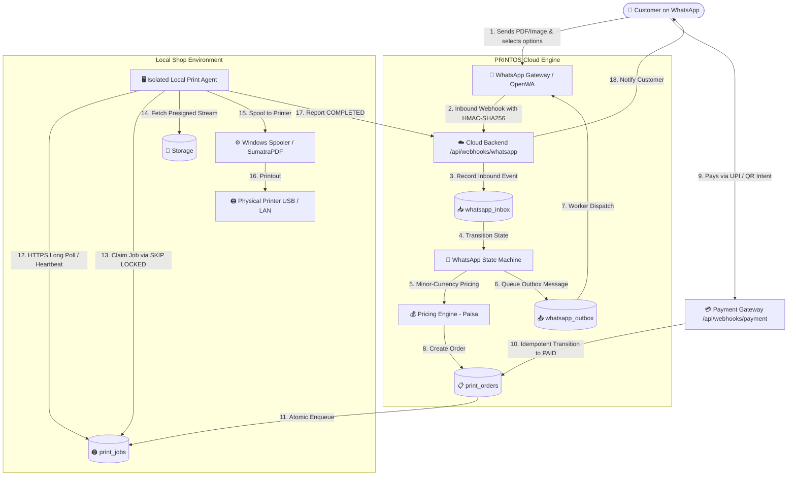

# PRINTOS — WhatsApp Automated Printing Service
## Architecture & Master Implementation Plan

---

## 1. System Overview

PRINTOS is a production-grade automated printing service designed for print shops. Customers interact via WhatsApp to upload documents, configure print settings, receive deterministic price quotes, and pay via UPI. Upon payment verification, orders are automatically placed in an atomic print queue, claimed by a local Windows Print Agent over authenticated HTTPS, and printed by a physical printer.

---

## 2. High-Level Architecture

---

## 3. Database Entities & Invariants

1. **`printers`**:
   - Manages physical hardware properties (`supports_color`, `supports_duplex`, `supported_paper_sizes`).
   - Dynamically reports `ONLINE` / `OFFLINE` / `BUSY` based on agent heartbeat.
2. **`print_agents`**:
   - Local shop computer daemons with hashed API keys and reported capabilities.
3. **`print_settings`**:
   - Configurable pricing per paper size and color mode in integer **paisa** minor units.
4. **`print_orders`**:
   - Full order lifecycle, customer phone, file specs, copies, page selection, and amounts.
5. **`print_jobs`**:
   - Atomic queue entries with unique constraint on `order_id` (guarantees idempotency).
   - Tracks attempts (`attempt_count`), priority, and error messages.
6. **`payment_transactions`**:
   - Ledger of all gateway callbacks with unique constraint on `(provider, transaction_id)`.
7. **`whatsapp_inbox` & `whatsapp_outbox`**:
   - Inbound webhook audit log and outbound message queue with exponential backoff worker engine.
8. **`print_order_events`**:
   - Immutable audit trail recording every state change and customer interaction.

---

## 4. Phase-by-Phase Roadmap

- **Phase 1: Core Foundation & Engine (COMPLETED)**
  - Greenfield Next.js App Router setup with strict TypeScript & Tailwind CSS.
  - Supabase SQL migrations with `claim_next_print_job` stored procedure (`FOR UPDATE SKIP LOCKED`).
  - Deterministic minor-currency (paisa) Pricing Engine.
  - Reusable Page Range Parser & Validator (dedupes, sorts, validates bounds).
  - Strict Order State Machine with transition protections.
  - Document Inspector abstraction with PDF and image inspection.
  - Full Admin Dashboard (`/admin`, `/admin/orders`, `/admin/queue`, `/admin/printers`).
  - Standalone Mock Print Agent with heartbeat, queue claiming, and failure simulation.
  - 100% passing test suite (37 unit tests + end-to-end acceptance suite).

- **Phase 2: WhatsApp Integration & Interactive Conversation Engine (COMPLETED)**
  - `IWhatsAppProvider` adapter implementation with OpenWA, Meta Cloud API, and Mock providers.
  - Conversational state machine (`IDLE` ➔ `AWAITING_DOCUMENT` ➔ `AWAITING_CONFIG` ➔ `AWAITING_PAYMENT`).
  - Inbound webhook processing with HMAC-SHA256 signature verification.
  - Resilient outbound message queue (`whatsapp_outbox`) and worker engine with exponential backoff.
  - Fulfillability policy check (verifying matching `ONLINE` hardware before payment quote).
  - Full automated test suite (74+ tests passing across 13 test suites).

- **Phase 3: Production Payment Gateway & Dynamic UPI Intents (COMPLETED)**
  - Payment abstraction layer (`IPaymentProvider`) with `RazorpayPaymentProvider` and `MockPaymentProvider`.
  - Dynamic NPCI UPI URI Scheme intent generation (`upi://pay?...`) with QR payload & checkout URL.
  - Robust HMAC-SHA256 webhook signature verification (`X-Razorpay-Signature`).
  - Strict integer paisa amount reconciliation rejecting client-side tampering.
  - Idempotent payment webhook (`/api/webhooks/payment`) transitioning orders to `PAID` ➔ `QUEUED` with atomic `print_jobs` creation.
  - Late payment on expired orders with automated hardware fulfillability evaluation.
  - Full automated test suite (87+ tests passing across 15 test suites).

- **Phase 4: Production Windows Print Agent (COMPLETED)**
  - Native Windows Print Agent daemon (`src/agent/windows-print-agent.ts`) with zero-trust token authentication (`x-agent-key`).
  - Automated hardware capability discovery via Windows WMI/CIM (`Get-CimInstance Win32_Printer`).
  - Silent background printing via SumatraPDF CLI with strict duplex, color, copies, and page range flags.
  - Native Windows Print Spooler PowerShell fallback (`Start-Process -Verb PrintTo`).
  - Ephemeral document streaming with strict `finally` block cleanup.
  - Full automated test suite (92+ tests passing across 16 test suites).

- **Phase 5: Production Hardening, Observability & Cleanup (COMPLETED)**
  - File retention & document purge cron endpoint (`/api/cron/cleanup`) with `CRON_SECRET` authentication.
  - Fail-fast production environment validator (`ProductionEnvValidator`) detecting misconfiguration on startup.
  - Sliding-window memory rate limiter (`MemoryRateLimiter`) protecting public webhook routes against abuse.
  - Structured JSON/formatted contextual logging (`Logger`) across all critical paths.
  - 100% passing automated test suite (101+ tests across 19 test suites).
