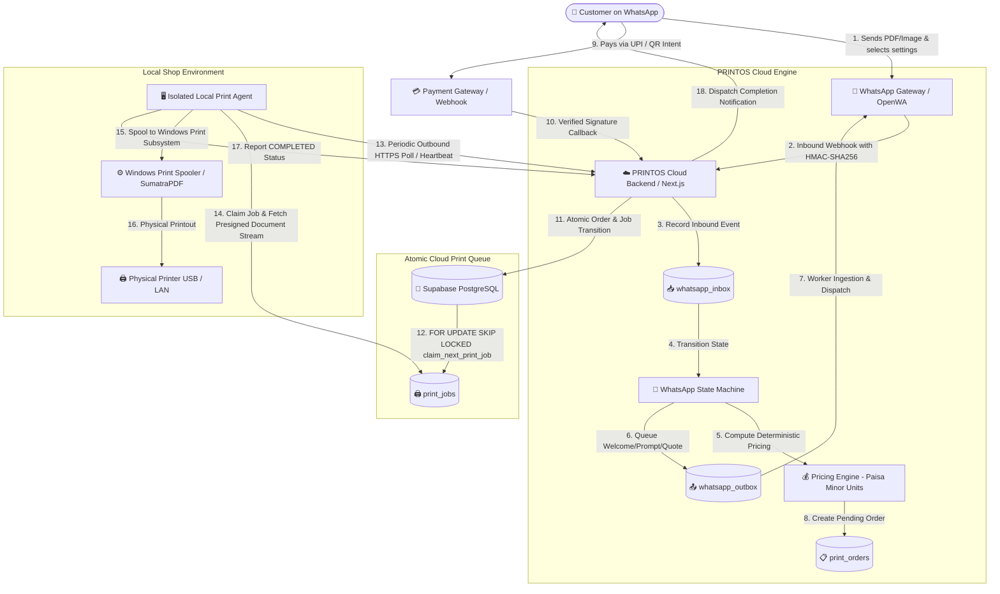

# PRINTOS — WhatsApp Automated Printing Service & POS

[](https://www.typescriptlang.org/)
[](https://nextjs.org/)
[](https://supabase.com/)
[](https://vitest.dev/)
[](https://tailwindcss.com/)
[](LICENSE)

> **Enterprise-grade, automated self-service printing operating system for print shops — featuring conversational WhatsApp document ingestion, deterministic minor-currency UPI pricing, atomic cloud queueing, and isolated local Windows print agents.**

---

## 📖 Table of Contents

- [Overview](#-overview)
- [Architecture](#-architecture)
- [Key Features](#-key-features)
- [Tech Stack](#-tech-stack)
- [Project Documentation](#-project-documentation)
- [Current Status & Roadmap](#-current-status--roadmap)
- [Quick Start & Local Setup](#-quick-start--local-setup)
- [Running the Mock Agent](#-running-the-mock-agent)
- [Testing & Quality Assurance](#-testing--quality-assurance)
- [GitHub Repository Topics](#-github-repository-topics)

---

## 🌟 Overview

**PRINTOS** transforms local print shops and copy centers into autonomous, 24/7 self-service operations. Customers simply send PDFs or images to the shop's WhatsApp number, configure print options (color mode, copies, page selection, duplex), receive an instant deterministic price quote with a dynamic UPI payment link/QR, and pay. 

Upon payment confirmation, the order is atomically claimed by an isolated local **Windows Print Agent** connected to physical USB/LAN printers via authenticated HTTPS, printing the document without human intervention.

---

## 🏗 Architecture

### End-to-End System Flow



---

## ✨ Key Features

- **💬 Conversational WhatsApp Document Ingestion**: Seamless document submission (PDFs, JPGs, PNGs) with interactive conversation flow (`IDLE` ➔ `AWAITING_DOCUMENT` ➔ `AWAITING_CONFIG` ➔ `AWAITING_PAYMENT`).
- **💰 Deterministic Minor-Currency Pricing**: Integer *paisa* calculations guaranteeing zero IEEE-754 floating-point rounding errors across paper sizes (A4, A3, Legal), color modes (B&W, Color), duplex, and volume discounts.
- **🔒 Zero-Trust Local Print Agent**: Local print shop computer communicates via outbound authenticated HTTPS (`x-agent-key`). Cloud backend never accesses local USB/LAN printer networks directly.
- **⚡ Atomic Concurrency & Job Claiming**: Stored procedures utilizing `FOR UPDATE SKIP LOCKED` ensure exactly one agent claims a print job even during high-concurrency spikes.
- **🛡️ Idempotent Webhook & Inbox Pipeline**: Robust SHA-256 HMAC signature verification and `wamid` / transaction idempotency keys prevent duplicate processing.
- **📊 Real-Time Admin Dashboard**: Modern Next.js App Router interface displaying live print queues, order statuses, printer telemetry, and revenue analytics.
- **🔄 Resilient Worker Engine**: Background queue polling with exponential backoff, dead-letter recovery, and configurable retry policies for transient failures and paper jams.

---

## 🛠 Tech Stack

| Layer | Technology | Purpose |
| :--- | :--- | :--- |
| **Framework** | [Next.js 14 (App Router)](https://nextjs.org/) | Full-stack serverless API routes, server components, and dynamic admin UI |
| **Language** | [TypeScript 5.4](https://www.typescriptlang.org/) | Strict end-to-end type safety across backend, models, and agent communication |
| **Database** | [Supabase](https://supabase.com/) / [PostgreSQL](https://www.postgresql.org/) | Relational database, RPC stored procedures, row-level locks, and event audits |
| **Styling** | [Tailwind CSS](https://tailwindcss.com/) + [Lucide Icons](https://lucide.dev/) | Premium dark/light responsive administrative dashboard |
| **WhatsApp Layer** | [OpenWA](https://openwa.dev/) / Meta Cloud API | Multi-session WhatsApp gateway with HMAC webhook delivery |
| **Document Processing** | [pdf-lib](https://pdf-lib.js.org/) | In-memory PDF inspection, page counting, and dimension validation |
| **Testing** | [Vitest](https://vitest.dev/) | Fast unit, integration, and end-to-end acceptance test runner |

---

## 📚 Project Documentation

Detailed architecture specifications, setup manuals, and testing guidelines are available in the repository:

| Document | Description |
| :--- | :--- |
| 📋 [**PRINTOS_IMPLEMENTATION_PLAN.md**](./PRINTOS_IMPLEMENTATION_PLAN.md) | Master architectural blueprint, database entity schemas, and multi-phase roadmap |
| ⚙️ [**PRINTOS_SETUP.md**](./PRINTOS_SETUP.md) | Step-by-step local development setup, environment variables, and execution guide |
| 🖨️ [**PRINTOS_PRINT_AGENT.md**](./PRINTOS_PRINT_AGENT.md) | Specification for the local isolated Windows Print Agent daemon and hardware integration |
| 🧪 [**PRINTOS_TESTING.md**](./PRINTOS_TESTING.md) | Comprehensive test suite reference, acceptance verification, and mock failure testing |

---

## 🚦 Current Status & Roadmap

- [x] **Phase 1: Core Foundation & Engine**
  - Next.js 14 App Router architecture with strict TypeScript & Tailwind CSS.
  - Supabase SQL schema migrations with atomic `claim_next_print_job` RPC (`FOR UPDATE SKIP LOCKED`).
  - Paisa Pricing Engine, Page Range Parser, and Order State Machine.
  - Complete Admin Dashboard (`/admin`, `/admin/orders`, `/admin/queue`, `/admin/printers`).
  - Standalone Mock Print Agent daemon with heartbeat telemetry and simulated printing.
- [x] **Phase 2: WhatsApp & Payment Integration**
  - OpenWA WhatsApp integration provider with HMAC-SHA256 signature verification.
  - Inbound webhook processing pipeline (`whatsapp_inbox`) and outbox worker (`whatsapp_outbox`).
  - Conversational state machine (`IDLE` ➔ `AWAITING_DOCUMENT` ➔ `AWAITING_CONFIG` ➔ `AWAITING_PAYMENT`).
  - Fulfillability policy check (preventing payment if no compatible printer is `ONLINE`).
  - Mock and live WhatsApp provider abstractions.
- [ ] **Phase 3: Production Payment Gateway**
  - Production Razorpay / Cashfree UPI webhook handlers with dynamic QR intents.
- [ ] **Phase 4: Native Windows Print Agent Production Daemon**
  - Silent printing via SumatraPDF CLI / Windows Print Spooler API.
  - Automatic printer capability discovery via WMI/CIM.
- [ ] **Phase 5: Production Hardening & File Retention Cleanup**
  - Automated file purge cron jobs (`/api/cron/process-queues`), structured observability, and rate limiting.

---

## 🚀 Quick Start & Local Setup

For comprehensive instructions, see [PRINTOS_SETUP.md](./PRINTOS_SETUP.md).

### 1. Clone & Install Dependencies

```bash
git clone https://github.com/prasadshirfule/PRINTOS.git
cd PRINTOS
npm install
```

### 2. Configure Environment Variables

Create a `.env.local` file in the root directory:

```bash
# Cloud Backend Configuration
NEXT_PUBLIC_APP_URL="http://localhost:3000"
NODE_ENV="development"

# Print Agent Security Key
PRINTOS_AGENT_KEY="mock-agent-secret-token"
PRINTOS_AGENT_NAME="shop-pc-01"
PRINTOS_API_URL="http://localhost:3000"

# Optional: Supabase Production Credentials (In-memory repository is used if omitted)
# NEXT_PUBLIC_SUPABASE_URL="https://your-project.supabase.co"
# NEXT_PUBLIC_SUPABASE_ANON_KEY="your-anon-key"
# SUPABASE_SERVICE_ROLE_KEY="your-service-role-key"
```

### 3. Start Development Server

```bash
npm run dev
```

Navigate to:
- **Admin Dashboard**: [http://localhost:3000/admin](http://localhost:3000/admin)
- **Live Print Queue**: [http://localhost:3000/admin/queue](http://localhost:3000/admin/queue)
- **Orders List**: [http://localhost:3000/admin/orders](http://localhost:3000/admin/orders)
- **Printers & Telemetry**: [http://localhost:3000/admin/printers](http://localhost:3000/admin/printers)

---

## 🤖 Running the Mock Agent

The Mock Print Agent simulates a shop computer claiming print jobs from the cloud queue:

```bash
# Standard mock agent daemon (healthy printer, 10s heartbeats)
npm run agent:mock

# Simulated hardware failure mode (tests paper jam, retry backoff & terminal failure)
npm run agent:mock:fail
```

---

## 🧪 Testing & Quality Assurance

PRINTOS includes a complete test suite covering unit calculations, concurrency invariants, and end-to-end acceptance flows:

```bash
# Run all Vitest test suites (13 test suites, 74+ tests)
npm test

# Run Phase 1 End-to-End Acceptance Test
npm run acceptance:phase1

# Run Phase 2 WhatsApp & Ingestion Acceptance Test
npm run acceptance:phase2

# Run TypeScript compilation and ESLint checks
npx tsc --noEmit
npm run lint

# Validate production build
npm run build
```

---

## 🏷️ GitHub Repository Topics

Recommended repository topics for GitHub discovery:
`whatsapp`, `print-shop`, `nextjs`, `supabase`, `postgresql`, `upi`, `pos`, `thermal-printing`, `automated-printing`, `typescript`, `openwa`, `print-queue`, `microservices`, `kiosk`

---

## 📄 License

This project is licensed under the MIT License — see the [LICENSE](LICENSE) file for details.
